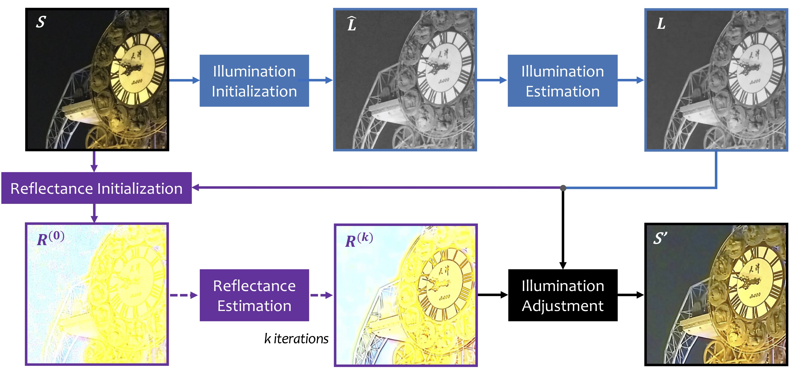

# LR3M

This repository contains sample code for paper "[LR3M: Robust Low-Light Enhancement via Low-Rank Regularized Retinex Model](https://ieeexplore.ieee.org/document/9056796)", published in *TIP 2020*

### Proposed Method
The proposed low-light enhancement method via **L**ow-**R**ank **R**egularized **R**etinex **M**odel (**LR3M**) simultaneously enhances the images and removes noise. The framework of our method is shown below. We first use an initial illumination to refine the final illumination. Following that we use the obtained illumination map and the input image *S* to get an initial reflectance map *R(0)*. Then we estimate a noise-free reflectance map based on low-rank regulation. Finally the enhanced image is generated from the illumination and reflectance after the illumination adjustment.
<p align="center">

</p>

### Prerequisites
- Original code is tested on Matlab R2017a 64bit, Windows 10
- Note that R2016b may lead to errors. 
### Usage
- This work is an extension of our [previous work](https://github.com/tonghelen/JED-Method).
- Our code for low-rank decomposition part is modified from [Dong *et al.*](https://ieeexplore.ieee.org/document/6319405).
- An example of how to run the algorithm is at `demo.m`.
### Citation
```
@ARTICLE{9056796,
  author={X. {Ren} and W. {Yang} and W. {Cheng} and J. {Liu}},
  journal={IEEE Transactions on Image Processing}, 
  title={LR3M: Robust Low-Light Enhancement via Low-Rank Regularized Retinex Model}, 
  year={2020},
  volume={29},
  number={},
  pages={5862-5876},}
```
